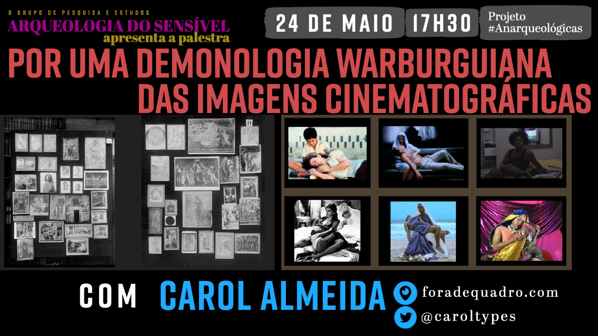
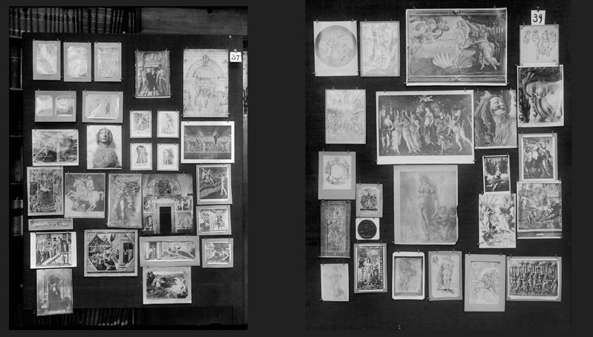
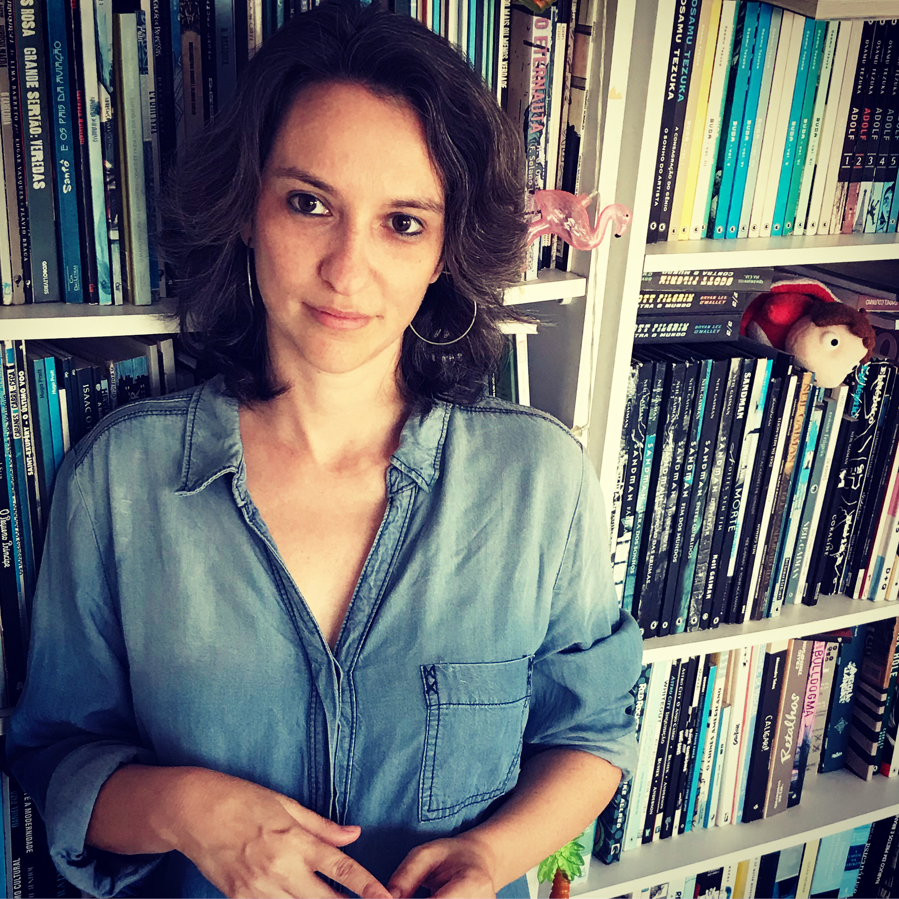

Palestra de [Carol Almeida](http://foradequadro.com/) no ciclo 2021.1 das [Conversas Anarqueológicas](http://arqueologiadosensivel.ufba.br/projetos/extensao/anarqueologicas)

## Por uma demonologia warburguiana das imagens cinematográficas

### Resumo

Forças não-humanas operavam ao redor de Aby Warburg (1866-1929). E ele as sentia. O historiador alemão que chegou a ser diagnosticado com esquizofrenia foi responsável, de dentro do seu processo de "loucura", por fundar novas bases para o pensamento iconográfico a partir de uma tentativa de reorganização das manifestações culturais no mundo em pranchas que aproximavam as imagens não por suas significações ou representações. Mas por suas intensidades, por suas concentrações de afetos, pelo páthos que elas manifestavam em comum. Ainda que nunca tenha, de fato, usado imagens cinematográficas em suas pranchas-constelações, a aposta metodológica warburguiana, pela natureza de pensar as imagens em exercícios de montagem, rende muitas conversas com os filmes, entre os filmes. Esta apresentação pretende pontuar a importância de trazer Warburg para pensar imagens cinematográficas que deixem de se relacionar somente pelas premissas de representação e causalidade, que tão bem servem aos três pilares da epistemologia moderna - a separabilidade, determinabilidade e sequencialidade (Denise Ferreira da Silva) - , e passem, portanto, a trocar energias que coloquem o humano e o supra-humano, novamente, em contato.

Assista à transmissão ao vivo no nosso canal do YouTube:

Imagens:

### Minibio

Carol Almeida: Doutora no programa de pós-graduação em Comunicação na UFPE, com pesquisa centrada no cinema contemporâneo brasileiro. Faz parte da equipe curatorial do Festival Olhar de Cinema/Curitiba desde 2017, e já participou da curadoria do Recifest, da Mostra Sesc de Cinema e, mais recentemente, da 2ª Mostra de Cinema Árabe Feminino. Dá oficinas sobre crítica de cinema, curadoria, cinema brasileiro contemporâneo e representação de mulheres no cinema. Integrou júris de festivais como Tiradentes, Mostra de São Paulo, FestCurtas BH, Janela de Cinema e Animage. Escreve sobre cinema no blog [foradequadro.com](http://foradequadro.com/)

